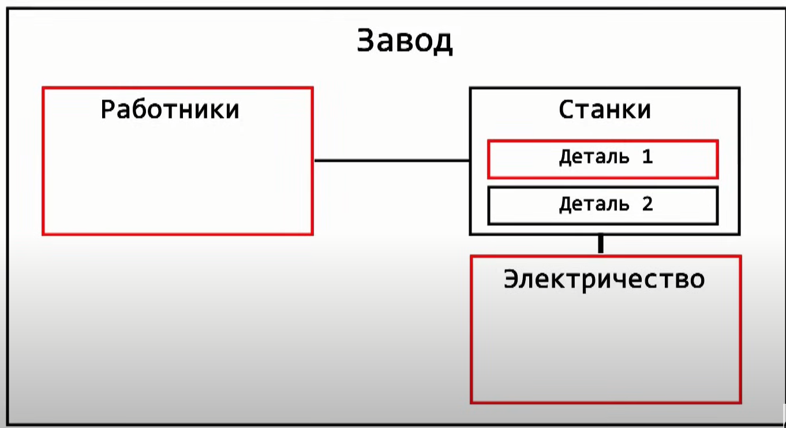
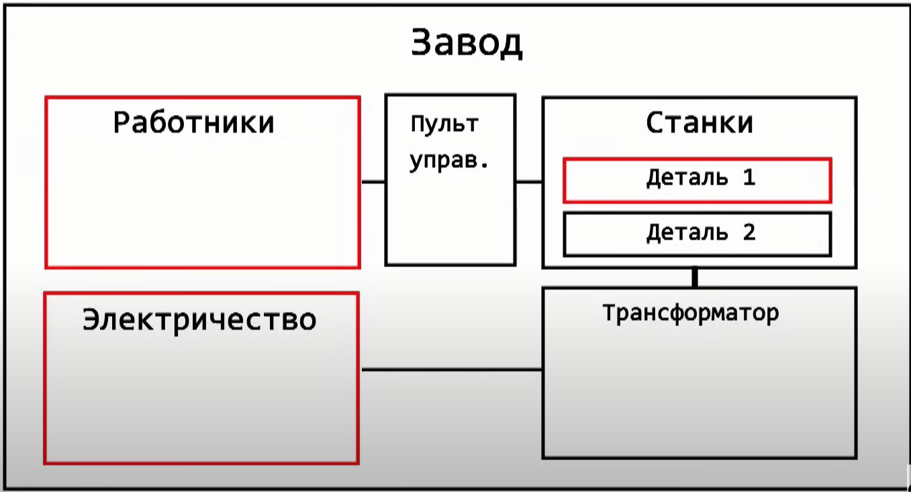

### Принцип инверсии зависимостей.

## КРАТКО:
Модуль верхнего уровня не должен быть тесно связан с модулем нижнего уровня
Между ними должна быть абстракция

### Пример
Смена детали влияет на **Работников** и **Электричество**, т.к. они не знают как работать с новой деталью


Поэтому нужно сделать абстракции: **Пульт управления** и **Трансформатор**:

Тогда **Работники** и **Электричество** не будут зависеть от смены **детали**

## ПОДРОБНО:

Допустим мы пишем приложение для магазина и решаем вопросы с проведением оплат. 

Вначале это просто небольшой магазин, где оплата происходит только за наличные. Создаем класс Cash и класс Shop.

```java
public class Cash {
    public void doTransaction(BigDecimal amount){
        //logic
    }
}
```

```java
public class Shop {
    private Cash cash;
    public Shop(Cash cash) {
        this.cash = cash;
    }
    public void doPayment(Object order, BigDecimal amount){
        cash.doTransaction(amount);
    }
}
```

Вроде все хорошо, но мы уже нарушили принцип инверсии зависимостей, 
так как мы тесно связали оплату наличными к нашему магазину. 

И если в дальнейшем нам необходимо будет добавить оплату еще банковской картой и телефоном ("100% понадобится"), то нам придется переписывать и изменять много кода. 

Мы в нашем коде модуль верхнего уровня тесно связали с модулем нижнего уровня, а нужно чтобы оба уровня зависели от абстракции.

## ПРАВИЛЬНО

Создадим Payments:
```java
public interface Payments {
    void doTransaction(BigDecimal amount);
}
```

```java
public class Cash implements Payments{
    @Override
    public void doTransaction(BigDecimal amount) {
        //logic
    }
}
```

```java
public class BankCard implements Payments{
    @Override
    public void doTransaction(BigDecimal amount) {
         //logic
    }
}
```

```java
public class PayByPhone implements Payments {
    @Override
    public void doTransaction(BigDecimal amount) {
        //logic 
    }
}
```

```java
public class Shop {
    private Payments payments;

    public Shop(Payments payments) {
        this.payments = payments;
    }

    public void doPayment(Object order, BigDecimal amount){
        payments.doTransaction(amount);
    }
}
```

### Сейчас наш магазин слабо связан с системой оплаты, то есть он зависит от абстракции и уже не важно каким способом оплаты будут пользоваться (наличными, картой или телефоном) все будет работать.